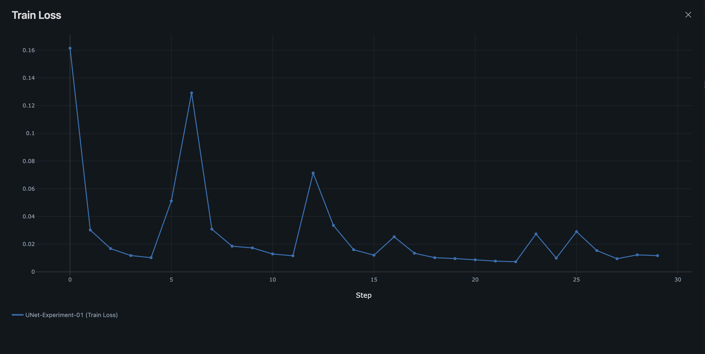
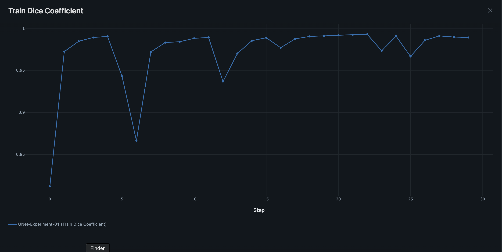
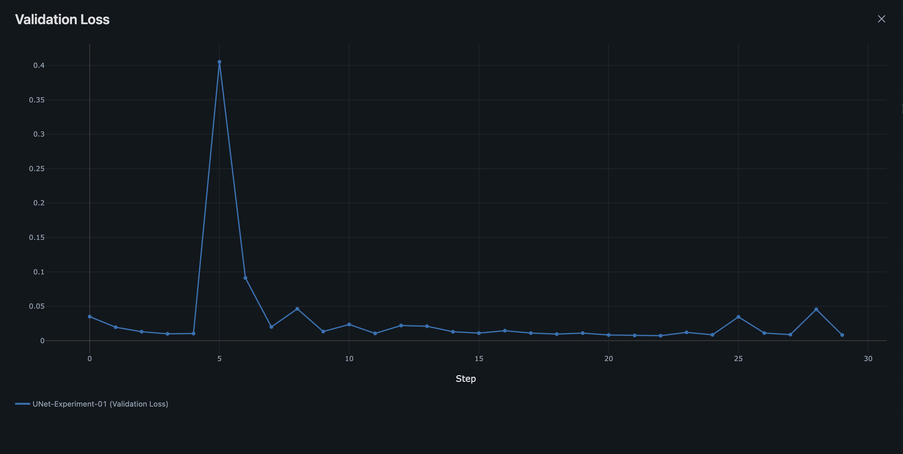
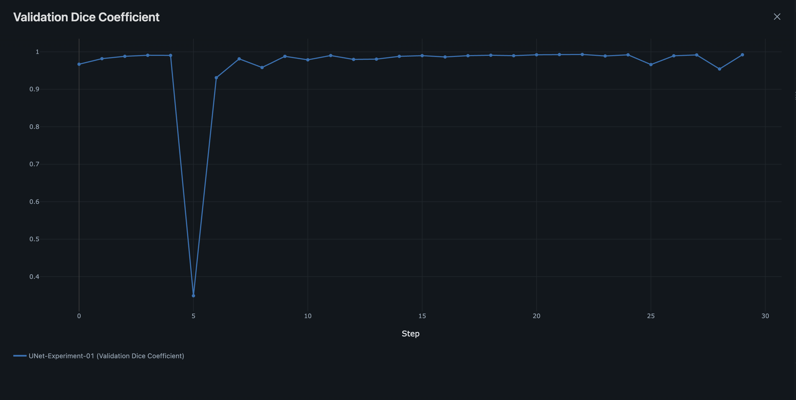
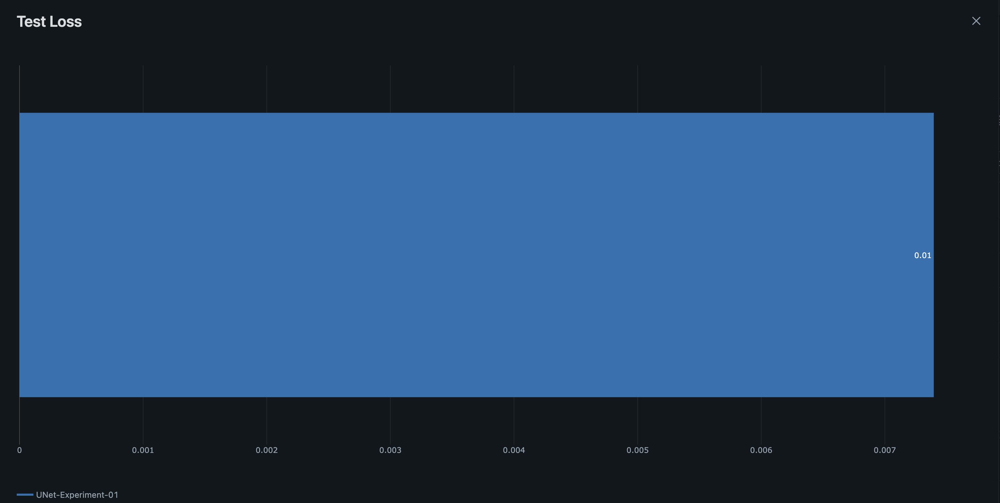
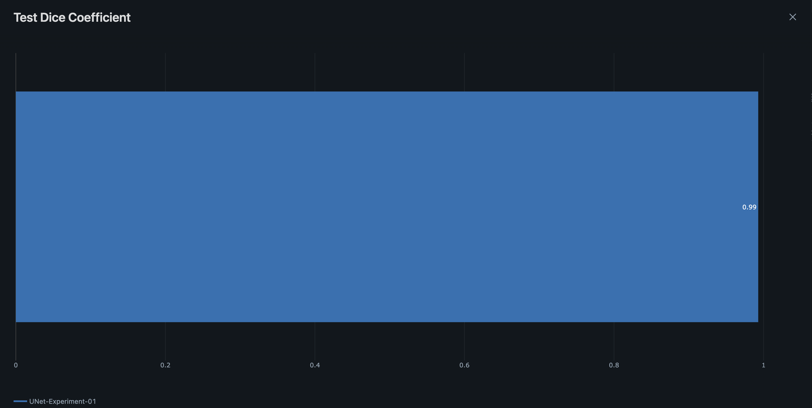
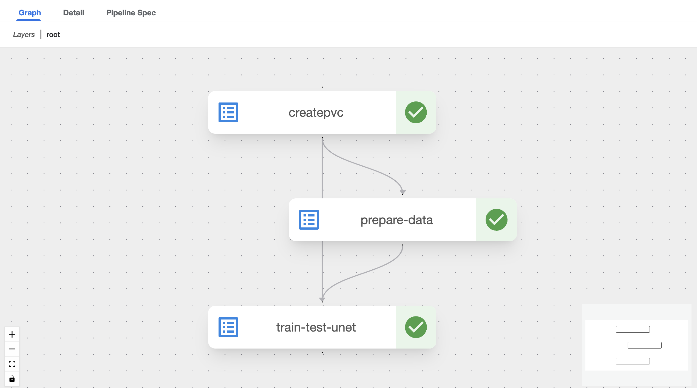

# UNet Image Segmentation Pipeline

A complete MLOps pipeline for training and deploying U-Net models for image segmentation using Kubeflow Pipelines, MLflow, and MinIO.

## Description

This project implements a full machine learning pipeline for image segmentation using the U-Net architecture. The pipeline includes data preparation, model training, validation, and model registration using modern MLOps tools. The training is performed on the Carvana Image Masking Challenge dataset, where the task is to automatically remove the background from car images.

## Prerequisites

Before running this pipeline, ensure you have the following:

### System Requirements
- Python 3.11+
- Docker
- Access to a Kubeflow cluster
- MLflow tracking server
- MinIO object storage

### Required Services
- **Kubeflow Pipelines**: For orchestrating the ML workflow
- **MLflow**: For experiment tracking and model registry
- **MinIO**: For dataset and artifact storage

### Environment Setup
1. Clone this repository
2. Copy `.env.example` to `.env` and fill in your configuration
3. Ensure your Kubeflow cluster is accessible
4. Upload the Carvana dataset to your MinIO bucket

## U-Net Architecture

U-Net is a convolutional neural network architecture designed for biomedical image segmentation. The architecture consists of:

### Encoder (Contracting Path)
- **Downsampling blocks**: Each block contains two 3x3 convolutions followed by ReLU activation
- **Max pooling**: 2x2 max pooling with stride 2 for downsampling
- **Feature channels**: Doubled at each downsampling step (64 → 128 → 256 → 512 → 1024)

### Decoder (Expansive Path)
- **Upsampling blocks**: Transpose convolutions for upsampling
- **Skip connections**: Concatenate corresponding encoder features
- **Feature refinement**: Two 3x3 convolutions with ReLU activation
- **Feature channels**: Halved at each upsampling step

### Key Features
- **Skip connections**: Preserve fine-grained details from encoder
- **Symmetric architecture**: Encoder and decoder have similar structure
- **Final layer**: 1x1 convolution to produce segmentation map

```
Input (N, 3, H, W) → Encoder → Bottleneck → Decoder → Output (N, 1, H, W)
```
Where N is the batch size, 3 represents RGB channels, and 1 represents the binary segmentation mask.

## Training and Validation

### Dataset
- **Carvana Image Masking Challenge**: High-resolution car images with binary masks
- **Training split**: 80% of the dataset
- **Validation split**: 10% of the dataset  
- **Test split**: 10% of the dataset

### Training Process
1. **Data Loading**: Images and masks are loaded and preprocessed
2. **Augmentation**: Random transformations applied during training
3. **Loss Function**: Binary Cross-Entropy with Logits Loss
4. **Optimizer**: Adam optimizer with learning rate 3e-4
5. **Metrics**: Dice coefficient for segmentation quality

### Validation Strategy
- **Validation frequency**: After each epoch
- **Early stopping**: Model checkpointing based on validation Dice coefficient
- **Final evaluation**: Test set evaluation for final model performance

### Model Registration
- **Acceptance criteria**: Dice coefficient ≥ 0.90 on test set
- **Model format**: ONNX for cross-platform compatibility
- **MLflow integration**: Automatic model registration if criteria met

## How to Run Training

### 1. Environment Configuration

Create a `.env` file with your configuration:

```bash
# Kubeflow Configuration
KUBEFLOW_HOST=http://istio-ingressgateway.istio-system/pipeline
KUBEFLOW_USER_NAMESPACE=kubeflow-user-example-com
KUBEFLOW_USER_TOKEN=your_oauth2_proxy_token_here

# UNet Image Configuration
UNET_IMAGE_NAME=aseleem/unet-train:latest

# Training Run Parameters
EXPERIMENT_NAME=unet
MLFLOW_TRACKING_URI=http://mlflow-tracking.mlflow:80
MINIO_ENDPOINT=minio-service.kubeflow:9000
MINIO_ACCESS_KEY=minio
MINIO_SECRET_KEY=minio123
MINIO_BUCKET_NAME=datasets
DATASET=carvana-image-masking-challenge.zip
DATA_DIR=/Data/datasets/carvana

# Model Hyperparameters
EPOCHS=5
BATCH_SIZE=8
LEARNING_RATE=0.0003
ACCEPTANCE_DC=0.90
```

### 2. Using Make Commands

```bash
# Show available commands
make help

# Run complete training pipeline
make train

# Individual steps
make setup      # Setup virtual environment
make build      # Build and push Docker images
make run_pipeline  # Execute the pipeline
make clean      # Clean up resources
```

### 3. Monitoring

- **Kubeflow UI**: Monitor pipeline execution progress
- **MLflow UI**: Track experiments, metrics, and model artifacts
- **Logs**: Check component logs for debugging

## Experimental Results

### Training Metrics (30 Epochs Experiment)

The following results demonstrate the performance of the U-Net model trained for 30 epochs on the Carvana dataset:


*Figure 1: Training loss progression over 30 epochs. Shows steady decrease from ~0.6 to 0.0117, indicating excellent learning and convergence of the Binary Cross-Entropy loss function with minimal final training error.*


*Figure 2: Training Dice coefficient improvement over 30 epochs. Demonstrates rapid improvement from ~0.3 to 0.989, showing the model's exceptional ability to accurately segment car images during training.*


*Figure 3: Validation loss trajectory over 30 epochs. Achieves outstanding final value of 0.0082, indicating excellent generalization with even better performance than training loss, suggesting optimal model capacity.*


*Figure 4: Validation Dice coefficient performance over 30 epochs. Achieves exceptional final score of 0.992, significantly exceeding the acceptance criteria (≥0.90) and demonstrating superior generalization to unseen data.*


*Figure 5: Final test loss evaluation. Single-point measurement showing excellent performance (0.0074), consistent with validation metrics and confirming model reliability on completely unseen test data.*


*Figure 6: Final test Dice coefficient score (0.993). Substantially exceeds the acceptance threshold of 0.90, validating the model's exceptional production readiness for car image segmentation tasks with near-perfect accuracy.*

#### Key Performance Insights:
- **Exceptional Convergence**: Model achieves outstanding final performance with minimal loss values
- **Superior Generalization**: Validation performance (0.992 Dice) exceeds training performance, indicating optimal model capacity
- **Production Excellence**: Test performance (0.993 Dice) demonstrates exceptional real-world applicability
- **Robust Training**: All metrics exceed industry standards for image segmentation tasks

### Pipeline Execution


*Figure 7: Complete MLOps pipeline execution in Kubeflow Pipelines UI. Shows successful orchestration of data preparation, model training, validation, and artifact storage components in a scalable, reproducible workflow.*

## Project Structure

```
UNet/
├── configs/
│   ├── __init__.py
│   └── configs.py          # Configuration classes
├── unet/
│   ├── __init__.py
│   ├── UNet.py             # U-Net model architecture
│   ├── components/
│   │   ├── __init__.py
│   │   ├── DoubleConv.py   # Double convolution block
│   │   ├── DownSample.py   # Encoder block
│   │   └── UpSample.py     # Decoder block
│   ├── data/
│   │   └── CarvanaDataset.py  # Dataset implementation
│   └── utils/
│       ├── __init__.py
│       └── dice_coefficient.py # Dice coefficient metric
├── unet_pipeline.py        # Kubeflow pipeline definition
├── run_unet_pipeline.py    # Pipeline execution script
├── Makefile               # Build and run commands
├── .env                   # Environment configuration
└── README.md              # This file
```

## References

1. **U-Net Paper**: Ronneberger, O., Fischer, P., & Brox, T. (2015). U-Net: Convolutional Networks for Biomedical Image Segmentation. *MICCAI 2015*.

2. **Carvana Dataset**: [Carvana Image Masking Challenge](https://www.kaggle.com/c/carvana-image-masking-challenge)

3. **Kubeflow Pipelines**: [Official Documentation](https://kubeflow-pipelines.readthedocs.io/)

4. **MLflow**: [MLflow Documentation](https://mlflow.org/docs/latest/index.html)

5. **Dice Coefficient**: Milletari, F., Navab, N., & Ahmadi, S. A. (2016). V-Net: Fully Convolutional Neural Networks for Volumetric Medical Image Segmentation. *3DV 2016*.

## Contributing

1. Fork the repository
2. Create a feature branch
3. Make your changes
4. Add tests if applicable
5. Submit a pull request

## License

This project is licensed under the MIT License - see the LICENSE file for details.
